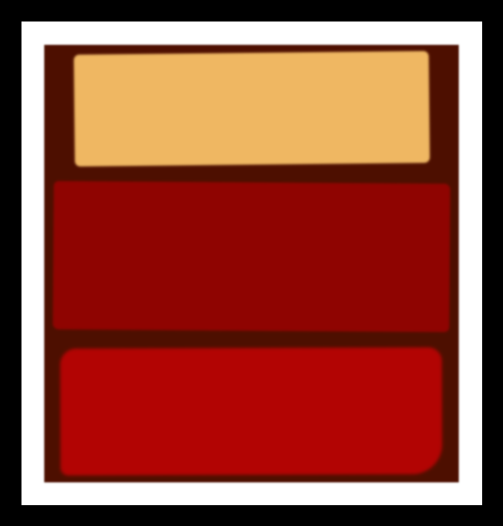

# Rothko Painting

A responsive Rothko painting project built using HTML and CSS as part of the FreeCodeCamp Responsive Web Design certification course. This version has been enhanced and customized to reflect my own style and understanding of CSS.

## Description

This project serves as a creative exercise in learning the CSS box model through the minimalist representation of a Rothko painting using div elements styled with CSS. While based on a project from FreeCodeCamp, I have made several modifications to improve responsiveness and visual aesthetics.

## Features

- Responsive design that adapts to different screen sizes.
- Utilizes CSS for styling and layout.
- Incorporates box shadows and filters for visual effects.
- Clean and simple design inspired by Rothko's artistic style.

## Technologies Used

- HTML
- CSS

## How to Run

1. Clone the repository to your local machine.
2. Open `rothkoPainting.html` in your web browser.

## Acknowledgments

This project was completed as part of the FreeCodeCamp Responsive Web Design certification course. Special thanks to FreeCodeCamp for providing the resources and guidance, which served as a foundation for my enhancements.
